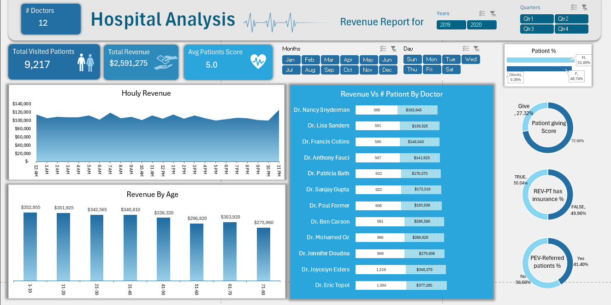

# 📊 Healthcare Analytics Project: Hospital Operational & Financial Performance

## 💡 Overview

This project provides a comprehensive, Excel-based analysis of a hospital's operational and financial performance. The analysis is built upon a real-world dataset comprising **9,200+ patient visits** and over **$2.5 million in total revenue**.

The primary objective is to transform raw operational data into actionable intelligence, uncovering core revenue drivers, optimizing resource allocation based on traffic patterns, and benchmarking physician performance for management decision-making.

---

## 🚀 Key Features & Analytical Deep Dives

* **Full Data Cleaning & Preprocessing:** Rigorous data cleaning, validation, and normalization performed entirely within Excel.
* **Seasonal Trend Detection:** Identification of key seasonal patterns, including a noticeable operational slowdown during January and December.
* **Hourly Traffic & Revenue Patterns:** Detailed analysis of patient visit and revenue distribution across all 24 hours to identify peak operational windows.
* **Revenue Segmentation:** Segmentation and analysis of revenue contributions across different **Age Groups**.
* **Physician Performance Benchmarking:** Evaluation of individual physician productivity based on visit volume and revenue generated.
* **Decision-Oriented Dashboard:** A clean, interactive Excel dashboard designed to present Key Performance Indicators (KPIs) and insights at a glance for executive review.

---

## 🛠 Technical Skills & Tools Used

| Category | Tools & Functions Used | Description |
| :--- | :--- | :--- |
| **Data Analysis** | Microsoft Excel (Advanced) | The core tool for data manipulation, analysis, and visualization. |
| **Excel Functions** | `HOUR`, `MOD`, `EDATE`, `IF`, `AND`, `OR`, `VLOOKUP` | Advanced date/time manipulation and conditional logic for complex calculations. |
| **Data Aggregation** | Pivot Tables & Pivot Charts, `SUMIF`, `COUNTIF` | Used for multi-dimensional data grouping, summarizing, and creating dynamic reports. |
| **Dashboard Design** | Slicers, Logical Visual Hierarchy | Creating an interactive, user-friendly interface for dynamic filtering by **Month / Quarter / Age / Doctor**. |

---

## 🖼 Dashboard Preview

Below is a snapshot of the final, interactive management dashboard.

****

 

---

## 📂 Project Files

| File Name | Description |
| :--- | :--- |
| `Healthcare_Analytics_Full_Report.pdf` | A detailed, professional report outlining the methodology, key findings, and strategic recommendations. |
| `[Hospital_Analytics_File].xlsx` | The complete Excel workbook containing the raw data, calculations, pivot tables, and the final dashboard. |
| `dashboard.png` | Screenshot of the finalized interactive dashboard. |
| `README.md` | This documentation file. |

---

## 📘 How to Use This Project

1.  **View the Report:** Open and read the `Healthcare_Analytics_Full_Report.pdf` for a deep understanding of the analysis methodology and outcomes.
2.  **Explore the Dashboard:** Open the Excel file and interact with the slicers to dynamically filter data by Doctor, Month, Age, or Quarter.
3.  **Review Documentation:** Use this `README` as a guide for the project's scope and technical execution.

---

## 🧭 Future Enhancements

* **Power BI/Tableau Integration:** Develop an interactive version of the dashboard in a dedicated Business Intelligence tool.
* **Predictive Analytics:** Implement time-series models to forecast future patient traffic and revenue streams.
* **Data Automation:** Use Power Query (Get & Transform) for ETL process automation and efficient data refreshes.
* **External Data Enrichment:** Incorporate external datasets (e.g., local weather, holiday schedules, referral source data) to enrich predictive models.

---

## ✍️ Author

Prepared by **Tariq** as a part of a professional data analytics portfolio.

For feedback, collaboration, or suggestions — feel free to connect!
